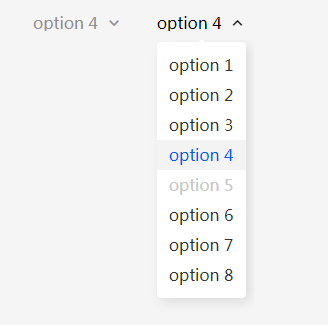
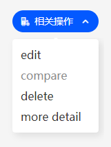
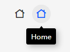
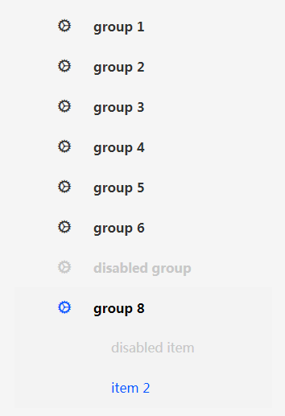
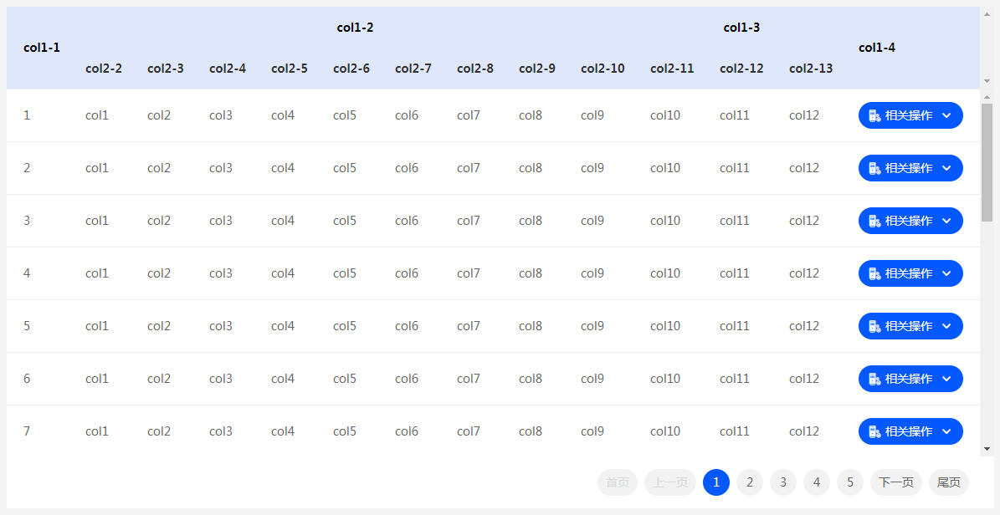

[简体中文](./README_zh.md)|English

# Ming-ui

>   ui framework for enterprise performance evaluation system


-   简体中文（[README_zh.md](./README_zh.md)）
-   English

## Author

-   Quarter ([https://shiruihua.cn](https://shiruihua.cn))


## Dependency

-   [wendux/fly](https://github.com/wendux/fly)


## Document

### m-select

**Attributes**

-   **disabled:** whether to disable components

**Styles**

-   **--m-select-color:** default color of select 
-   **--m-select-disable-color:** color of select when disabled
-   **--m-select-active-color:**  color of select wnen hovered
-   **--m-option-color:**  default color of option
-   **--m-option-active-color:**  color of option when actived
-   **--m-option-active-bg:**  background color of option when actived
-   **--m-option-disable-color:** color of option when disabled

**Values**

-   **disabled:** whether to disable components

**Methods**

-   **calcWidthAndPosition():** re-caculate component width and list position


### m-option

**Attributes**

-   **value:** options value (default value is options name)
-   **disabled:** whether to disable option
-   **selected:** whether to select option

**Styles**

-   none

**Values**

-   **value:** options value (default value is options name)
-   **disabled:** whether to disable option
-   **selected:** whether to select option

**Methods**

-   none


### m-operation-list

**Attributes**

-   **disabled:** whether to disabled components

**Styles**

-   **--m-operation-list-color:** default color of operation list
-   **--m-operation-list-bg:** default background color of operation list
-   **--m-operation-list-disable-color:** color of operation list when disabled
-   **--m-operation-list-disable-bg:** background color of operation list when disabled
-   **--m-operation-color:** default color of operaion
-   **--m-operation-active-color:** color of operation when actived
-   **--m-operation-active-bg:** background color of operation when actived
-   **--m-operation-disable-color:** color of operation when disabled

**Values**

-   **disabled:** whether to disabled components

**Methods**

-   **calcWidthAndPosition():** re-caculate component width and list position


### m-operation

**Attributes**

-   **operation:** function called when clicked
-   **disabled:** whether to disabled this operation

**Styles**

-   none

**Values**

-   **operation:** function called when clicked
-   **disabled:** whether to disabled this operation

**Methods**

-   none


### m-function

**Attributes**

-   **icon:** unicode of icon
-   **icon-class:** class of icon
-   **disabled:** whether to disabled this function
-   **operation:** function called when clicked
-   **tip:** tip showed when hover component

**Styles**

-   **--m-function-color:** default color of components
-   **--m-function-bg:** default background color of components
-   **--m-function-disable-color:** color of components when disabled
-   **--m-function-disable-bg:** background color of components when disabled

**Values**

-   **icon:** unicode of icon
-   **icon-class:** class of icon
-   **disabled:** whether to disabled this function
-   **operation:** function called when clicked
-   **tip:** tip showed when hover component

**Methods**

-   none


### m-icon-function

**Attributes**

-   **icon:** unicode of icon
-   **icon-class:** class of icon
-   **disabled:** whether to disabled this function
-   **operation:** function called when clicked
-   **tip:** tip showed when hover component

**Styles**

-   **--m-icon-function-color:** default color of components
-   **--m-icon-function-active-color:** color of components when actived
-   **--m-icon-function-active-bg:** background color of components when actived
-   **--m-icon-function-disable-color:** color of components when disabled
-   **--m-icon-function-tip-color:** default color of tip
-   **--m-icon-function-tip-bg:** default background color of tip

**Values**

-   **icon:** unicode of icon
-   **icon-class:** class of icon
-   **disabled:** whether to disabled this function
-   **operation:** function called when clicked
-   **tip:** tip showed when hover component

**Methods**

-   none


### m-menu

**Attributes**

-   **menu-target:** route target when menu clicked

**Styles**

-   none

**Values**

-   **menu-target:** route target when menu clicked

**Methods**

-   none


### m-menu-group

**Attributes**

-   **icon:** icon for menu group
-   **group-name:** first level menu name
-   **menu-route:** url of menu
-   **disabled:** whether to disable this menu group

**Styles**

-   **--m-menu-group-active-bg:**  background color of first level menu when actived
-   **--m-menu-group-color:** default color of first level menu
-   **--m-menu-group-disable-color:** color of first level menu when disabled
-   **--m-menu-group-icon-active-color:** color of menu icon when actived
-   **--m-menu-group-active-color:** color of menu name when actived
-   **--m-menu-group-icon-disable-color:** color of menu icon when disabled
-   **--m-menu-item-color:** default color of second level menu
-   **--m-menu-item-active-color:** color of second level menu when actived
-   **--m-menu-item-disable-color:** color of second level menu when disabled

**Values**

-   **icon:** icon for menu group
-   **group-name:** first level menu name
-   **menu-route:** url of menu
-   **disabled:** whether to disable this menu group

**Methods**

-   none


### m-menu-item

**Attributes**

-   **menu-route:** url of menu
-   **disabled:** whether to disable this menu

**Styles**

-   none

**Values**

-   **menuRoute:** url of menu
-   **disabled:** whether to disable this menu

**Operation**

-   none


### m-table

**Attributes**

-   none

**Styles**

-   none

**Values**

-   **config:** get table config

**Methods**

-   **register(config) :** config this component
-   **render():** re-render this table
-   **showError():** show table error page
-   **hideError():** hide table error page
-   **showEmpty():** show table empty page
-   **hideEmpty():** hide table empty page


## Usage

### import

```html
<script type="text/javascript" src="./ming/ming.js"></script>
```


### select

```html
<m-select>
    <m-option value="1">option 1</m-option>
    <m-option value="2">option 2</m-option>
    <m-option value="3">option 3</m-option>
    <m-option value="4" selected>option 4</m-option>
    <m-option value="5" disabled>option 5</m-option>
    <m-option value="6">option 6</m-option>
    <m-option value="7">option 7</m-option>
    <m-option value="8">option 8</m-option>
</m-select>
```

**preview**



### operation-list

```html
<m-operation-list>
    <m-operation operation="helloWorld">edit</m-operation>
    <m-operation operation="helloWorld" disabled>compare</m-operation>
    <m-operation>delete</m-operation>
    <m-operation>more detail</m-operation>
</m-operation-list>
```

**preview**



### function

```html
<m-function icon-class="ming-icon-plus" tip="upload image"></m-function>
```

**preview**


### icon-function

```html
<m-icon-function icon-class="ming-icon-home" tip="Home" operation="helloWorld"></m-icon-function>
```

**preview**



### menu

```html
<m-menu menu-target="main-content">
    <m-menu-group icon="ming-icon-settings" group-name="group 1">
        <m-menu-item menu-route="">item 1</m-menu-item>
        <m-menu-item menu-route="">item 2</m-menu-item>
    </m-menu-group>
    <m-menu-group icon="ming-icon-settings" group-name="group 2">
        <m-menu-item menu-route="">item 1</m-menu-item>
        <m-menu-item menu-route="">item 2</m-menu-item>
        <m-menu-item menu-route="">item 3</m-menu-item>
        <m-menu-item menu-route="">item 4</m-menu-item>
    </m-menu-group>
    <m-menu-group icon="ming-icon-settings" group-name="group 3">
        <m-menu-item menu-route="">item 1</m-menu-item>
        <m-menu-item menu-route="">item 2</m-menu-item>
    </m-menu-group>
    <m-menu-group icon="ming-icon-settings" group-name="group 4" menu-route=""></m-menu-group>
    <m-menu-group icon="ming-icon-settings" group-name="group 5">
        <m-menu-item menu-route="">item 1</m-menu-item>
        <m-menu-item menu-route="">item 2</m-menu-item>
    </m-menu-group>
    <m-menu-group icon="ming-icon-settings" group-name="group 6">
        <m-menu-item menu-route="">item 1</m-menu-item>
        <m-menu-item menu-route="">item 2</m-menu-item>
        <m-menu-item menu-route="">item 3</m-menu-item>
    </m-menu-group>
    <m-menu-group icon="ming-icon-settings" group-name="disabled group" disabled>
        <m-menu-item menu-route="">item 1</m-menu-item>
        <m-menu-item menu-route="">item 2</m-menu-item>
    </m-menu-group>
    <m-menu-group icon="ming-icon-settings" group-name="group 8">
        <m-menu-item menu-route="" disabled>disabled item</m-menu-item>
        <m-menu-item menu-route="">item 2</m-menu-item>
    </m-menu-group>
</m-menu>
```

**preview**



### m-table

```html
<style type="text/css">
	.main-table {
        height: 600px;
    }
</style>

<m-table class="main-table" id="main-table"></m-table>

<script type="text/javascript">
	let config = {
        pageSize: 20,
        data: async function () {
            let tabledata = {
                status: 0,
                data: [],
                total: 0,
            };
            await fly.get('/data/table_example.json')
                .then(function (response) {
                    if (response.status == 200) {
                        tabledata.status = response.status;
                        if (response.data.status == 200) {
                            tabledata.data = response.data.data;
                            tabledata.total = response.data.total;
                        }
                    }
                });
            return tabledata;
        },
        columns: [
            [
                {
                    title: 'col1-1',
                    rowspan: 2,
                    formatter: function (column, row, index) {
                        return index + 1;
                    }
                },
                {title: 'col1-2', colspan: 9},
                {title: 'col1-3', colspan: 3},
                {
                    title: 'col1-4',
                    fixed: true,
                    rowspan: 2,
                    formatter: function (column, row, index) {
                        return `<m-operation-list>
                            <m-operation>operation A</m-operation>
                            <m-operation>operation B</m-operation>
                            <m-operation>operation C</m-operation>
                        </m-operation-list>`;
                    }
                },
            ],
            [
                {title: 'col2-2', field: 'col1'},
                {title: 'col2-3', field: 'col2'},
                {title: 'col2-4', field: 'col3'},
                {title: 'col2-5', field: 'col4'},
                {title: 'col2-6', field: 'col5'},
                {title: 'col2-7', field: 'col6'},
                {title: 'col2-8', field: 'col7'},
                {title: 'col2-9', field: 'col8'},
                {title: 'col2-10', field: 'col9'},
                {title: 'col2-11', field: 'col10'},
                {title: 'col2-12', field: 'col11'},
                {title: 'col2-13', field: 'col12'},
            ]
        ]
    };

    document.querySelector('#main-table').register(config);
</script>
```




## More

-   [Document of table](./docs/DOC_TABLE.md)


## License

-   [MIT License](./LICENSE)