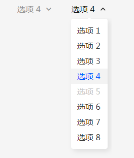
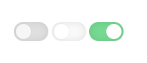
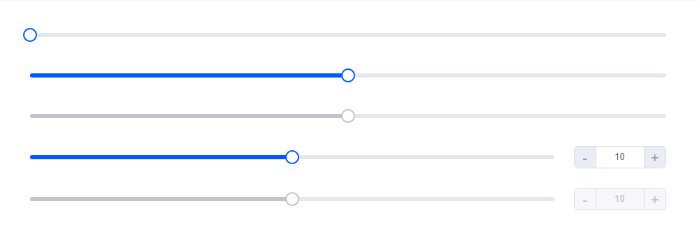
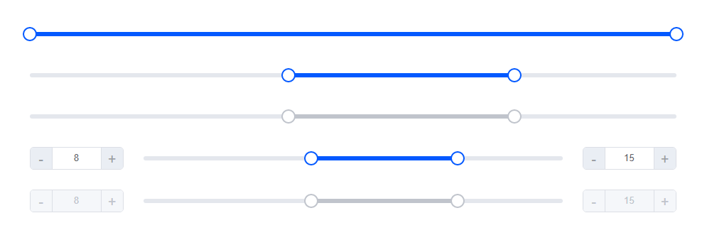
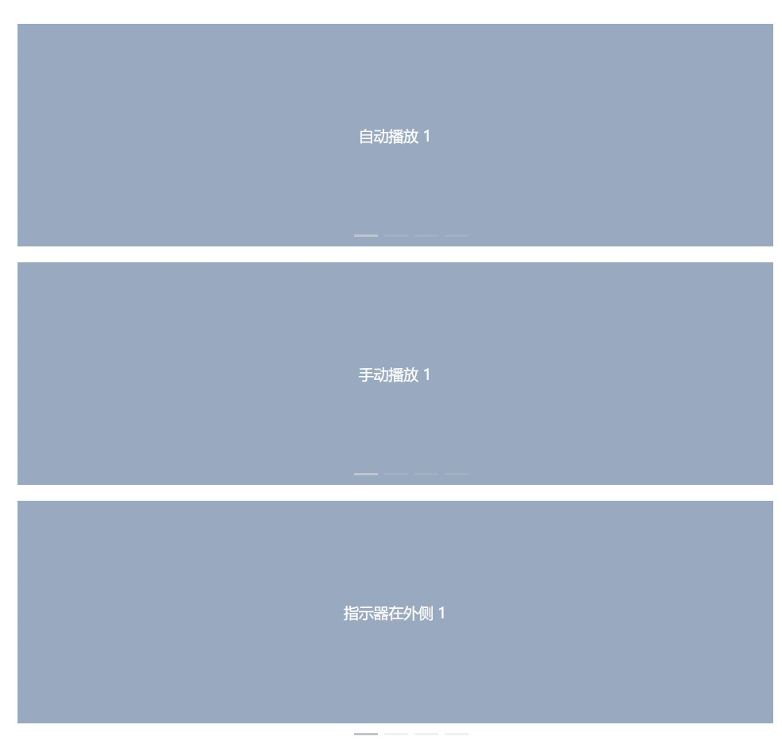
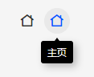
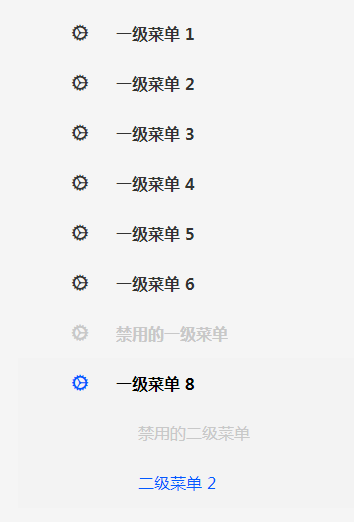
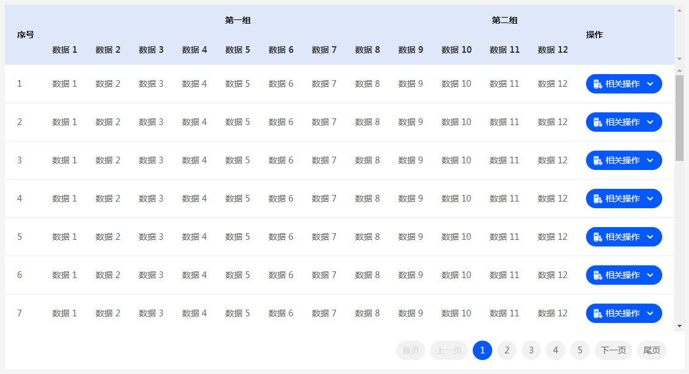

# 中文文档

## m-select

### 文档说明

**属性**

-   **disabled:** 是否禁用组件

**样式**

-   **--m-select-color:** 默认情况下的字体颜色
-   **--m-select-disable-color:**  禁用状态下的字体颜色
-   **--m-select-active-color:** 激活状态下的字体颜色
-   **--m-option-color:**  默认情况下选项的字体颜色
-   **--m-option-active-color:** 激活状态下选项的字体颜色
-   **--m-option-active-bg:**  激活状态下选项的背景颜色
-   **--m-option-disable-color:** 禁用状态下的字体颜色

**值**

-   **disabled:** 是否禁用组件

**方法**

-   **calcWidthAndPosition():** 重新计算组件布局

**事件**

-   **change:** 组件值改变


### 代码示例

```html
<m-select>
    <m-option value="1">选项 1</m-option>
    <m-option value="2">选项 2</m-option>
    <m-option value="3">选项 3</m-option>
    <m-option value="4" selected>选项 4</m-option>
    <m-option value="5" disabled>选项 5</m-option>
    <m-option value="6">选项 6</m-option>
    <m-option value="7">选项 7</m-option>
    <m-option value="8">选项 8</m-option>
</m-select>
```


### 预览




## m-option

### 文档说明

**属性**

-   **value:** 选项的值（缺省为选项的内容）
-   **disabled:** 是否禁用该选项
-   **selected:** 该选项是否选中

**样式**

-   无

**值**

-   **value:** 选项的值（缺省为选项的内容）
-   **disabled:** 是否禁用该选项
-   **selected:** 该选项是否选中

**方法**

-   无


## m-input

### 文档说明

**属性**

-   **value:** 输入框的值
-   **disabled:** 是否禁用输入框
-   **placeholder:** 提示文字
-   **type:** 文本框类型
-   **maxlength:** 最长字符长度限制

**样式**

-   **--m-input-width：** 输入框的宽度
-   **--m-input-line-height：** 输入框的行高
-   **--m-input-color：** 输入框为文字默认颜色
-   **--m-input-border-color：** 输入框的默认边框颜色
-   **--m-input-active-color：** 输入框的激活文字颜色
-   **--m-input-active-border-color：** 输入框的激活边框颜色
-   **--m-input-disable-color：** 输入框的禁用文字颜色
-   **--m-input-disable-border-color：** 输入框的禁用边框颜色

**值**

-   **value：** 输入框的内容
-   **placeholder：** 输入框的提示文字
-   **disabled：** 是否禁用数据框
-   **type：** 输入框的内容类型
-   **maxlength：** 输入框的字符长度限制

**方法**

-   无

**事件**

-   **focus:** 获得焦点
-   **blur:** 失去焦点
-   **change:** 值改变


### 代码示例

```html
<m-input type="text"></m-input>
<m-input type="text" disabled></m-input>
<m-input type="text" value="一家公司的名称"></m-input>
<m-input type="text" value="一家公司的名称" disabled></m-input>
<m-input type="text" value="一家公司的名称"></m-input>
```

**预览**


## m-switch

### 文档说明

**属性**

-   **value:** 当前状态
-   **disabled:** 是否禁用滑钮
-   **selected:** 是否打开

**样式**

-   无

**值**

-   **value：** 设置当前状态
-   **disabled：** 设置是否禁用滑钮

**方法**

-   无

**事件**

-   **change:** 值改变


### 代码示例

```html
<m-switch disabled></m-switch>
<m-switch></m-switch>
<m-switch selected></m-switch>
```


### 预览




## m-slider

### 文档说明

**属性**

- **value:** 当前状态
- **min:** 滑轨的最小值
- **max:** 滑轨的最大值
- **size:** 组件尺寸（min）
- **disabled:** 是否禁用滑钮
- **show-input:** 是否显示输入框

**样式**

- **--m-slider-main-color:** 主要色
- **--m-slider-auxiliary-color:** 次要色

**值**

- **value：** 设置或获取当前值
- **disabled：** 设置或获取是否禁用组件

**方法**

- 无

**事件**

- 无


### 代码示例

```html
<m-slider min="0" max="20" value="0"></m-slider>
<m-slider min="0" max="20" value="10"></m-slider>
<m-slider min="0" max="20" value="10" disabled></m-slider>
<m-slider min="0" max="20" value="10" show-input></m-slider>
<m-slider min="0" max="20" value="10" show-input disabled></m-slider>
```


### 预览




## m-range-slider

### 文档说明

**属性**

- **left:** 当前的左区间
- **right:** 当前的右区间
- **min:** 滑轨的最小值
- **max:** 滑轨的最大值
- **size:** 组件尺寸（min）
- **disabled:** 是否禁用滑钮
- **show-input:** 是否显示输入框

**样式**

- **--m-slider-main-color:** 主要色
- **--m-slider-auxiliary-color:** 次要色

**值**

- **value：** 设置或获取当前值
- **disabled：** 设置或获取是否禁用组件

**方法**

- 无

**事件**

- 无


### 代码示例

```html
<m-range-slider min="0" max="20" left="0" right="20"></m-range-slider>
<m-range-slider min="0" max="20" left="8" right="15"></m-range-slider>
<m-range-slider min="0" max="20" left="8" right="15" disabled></m-range-slider>
<m-range-slider min="0" max="20" left="8" right="15" show-input></m-range-slider>
<m-range-slider min="0" max="20" left="8" right="15" show-input disabled></m-range-slider>
```


### 预览




## m-album

### 文档说明

**属性**

- **autoplay:** 是否自动播放
- **interval:** 自动播放的间隔时间，默认为 3000ms
- **trigger:** 指示器的触发方式，click 或 hover
- **indicator-position:** 指示器的位置，outside 或 inside

**样式**

- 无

**值**

- 无

**方法**

- 无

**事件**

- 无


### 代码示例

```html
<m-album>
    <m-album-item>
        <h3>1</h3>
    </m-album-item>
    <m-album-item>
        <h3>2</h3>
    </m-album-item>
    <m-album-item>
        <h3>3</h3>
    </m-album-item>
    <m-album-item>
        <h3>4</h3>
    </m-album-item>
</m-album>
```


### 预览




## m-operation-list

### 文档说明

**属性**

-   **disabled:** 是否禁用组件

**样式**

-   **--m-operation-list-color:** 默认情况下的文字颜色
-   **--m-operation-list-bg:** 默认情况下的背景颜色
-   **--m-operation-list-disable-color:** 禁用状态下的字体颜色
-   **--m-operation-list-disable-bg:** 禁用状态下的背景颜色
-   **--m-operation-color:** 默认情况下操作项的字体颜色
-   **--m-operation-active-color:** 激活状态下操作项的字体颜色
-   **--m-operation-active-bg:** 激活状态下的操作项的背景颜色
-   **--m-operation-disable-color:** 禁用状态下的操作项的字体颜色

**值**

-   **disabled:** 是否禁用组件

**方法**

-   **calcWidthAndPosition():** 重新计算组件布局


### 代码示例

```html
<m-operation-list>
    <m-operation operation="helloWorld">编辑数据</m-operation>
    <m-operation operation="helloWorld" disabled>加入对比</m-operation>
    <m-operation>删除数据</m-operation>
    <m-operation>查看详情</m-operation>
</m-operation-list>
```


### 预览


## m-operation

### 文档说明

**属性**

-   **operation:** 点击时调用的操作
-   **disabled:** 是否禁用该选项

**样式**

-   无

**值**

-   **operation:** 点击时调用的操作
-   **disabled:** 是否禁用该选项

**方法**

-   无


## m-function

### 文档说明

**属性**

-   **icon:** 图标的unicode代码
-   **icon-class:** 图标的类名
-   **disabled:** 是否禁用组件
-   **operation:** 点击时调用的方法名
-   **tip:** 指针悬浮时显示的提示信息

**样式**

-   **--m-function-color:** 默认情况下的字体颜色
-   **--m-function-bg:** 默认情况下的背景颜色
-   **--m-function-disable-color:** 禁用状态下的字体颜色
-   **--m-function-disable-bg:** 禁用状态下的背景颜色

**值**

-   **icon:** 图标的unicode代码
-   **icon-class:** 图标的类名
-   **disabled:** 是否禁用组件
-   **operation:** 点击时调用的方法名
-   **tip:** 指针悬浮时显示的提示信息

**方法**

-   无


### 代码示例

```html
<m-function icon-class="ming-icon-plus" tip="上传图片"></m-function>
```


### 预览


## m-icon-function

### 文档说明

**属性**

-   **icon:** 图标的unicode代码
-   **icon-class:** 图标的类名
-   **disabled:** 是否禁用组件
-   **operation:** 点击时调用的方法名
-   **tip:** 指针悬浮时显示的提示信息

**样式**

-   **--m-icon-function-color:** 默认情况下的字体颜色
-   **--m-icon-function-active-color:** 激活状态下的字体颜色
-   **--m-icon-function-active-bg:** 激活状态下的背景颜色
-   **--m-icon-function-disable-color:** 禁用状态下的字体颜色
-   **--m-icon-function-tip-color:** 提示框的字体颜色
-   **--m-icon-function-tip-bg:** 提示框的背景颜色

**值**

-   **icon:** 图标的unicode代码
-   **icon-class:** 图标的类名
-   **disabled:** 是否禁用组件
-   **operation:** 点击时调用的方法名
-   **tip:** 指针悬浮时显示的提示信息

**方法**

-   无


### 代码示例

```html
<m-icon-function icon-class="ming-icon-home" tip="主页" operation="helloWorld"></m-icon-function>
```


### 预览




## m-menu

### 文档说明

**属性**

-   **menu-target:** 菜单操作的对象的id

**样式**

-   无

**值**

-   **menu-target:** 菜单操作的对象的id

**方法**

-   无

**事件**

-   **change**： 菜单改变


### 代码示例

```html
<m-menu menu-target="main-content">
    <m-menu-group icon="ming-icon-settings" group-name="一级菜单 1">
        <m-menu-item menu-route="">二级菜单 1</m-menu-item>
        <m-menu-item menu-route="">二级菜单 2</m-menu-item>
    </m-menu-group>
    <m-menu-group icon="ming-icon-settings" group-name="一级菜单 2">
        <m-menu-item menu-route="">二级菜单 1</m-menu-item>
        <m-menu-item menu-route="">二级菜单 2</m-menu-item>
        <m-menu-item menu-route="">二级菜单 3</m-menu-item>
        <m-menu-item menu-route="">二级菜单 4</m-menu-item>
    </m-menu-group>
    <m-menu-group icon="ming-icon-settings" group-name="一级菜单 3">
        <m-menu-item menu-route="">二级菜单 1</m-menu-item>
        <m-menu-item menu-route="">二级菜单 2</m-menu-item>
    </m-menu-group>
    <m-menu-group icon="ming-icon-settings" group-name="一级菜单 4" menu-route=""></m-menu-group>
    <m-menu-group icon="ming-icon-settings" group-name="一级菜单 5">
        <m-menu-item menu-route="">二级菜单 1</m-menu-item>
        <m-menu-item menu-route="">二级菜单 2</m-menu-item>
    </m-menu-group>
    <m-menu-group icon="ming-icon-settings" group-name="一级菜单 6">
        <m-menu-item menu-route="">二级菜单 1</m-menu-item>
        <m-menu-item menu-route="">二级菜单 2</m-menu-item>
        <m-menu-item menu-route="">二级菜单 3</m-menu-item>
    </m-menu-group>
    <m-menu-group icon="ming-icon-settings" group-name="禁用的一级菜单" disabled>
        <m-menu-item menu-route="">二级菜单 1</m-menu-item>
        <m-menu-item menu-route="">二级菜单 2</m-menu-item>
    </m-menu-group>
    <m-menu-group icon="ming-icon-settings" group-name="一级菜单 8">
        <m-menu-item menu-route="" disabled>禁用的二级菜单</m-menu-item>
        <m-menu-item menu-route="">二级菜单 2</m-menu-item>
    </m-menu-group>
</m-menu>
```


### 预览




## m-menu-group

### 文档说明

**属性**

-   **icon:** 一级菜单对应的图标类名
-   **group-name:** 一级菜单的名称
-   **menu-route:** 一级菜单对应的url
-   **disabled:** 菜单是否禁用

**样式**

-   **--m-menu-group-active-bg:** 激活时的菜单组的背景颜色
-   **--m-menu-group-color:** 默认状态下一级菜单的字体颜色
-   **--m-menu-group-disable-color:** 禁用状态下一级菜单的字体颜色
-   **--m-menu-group-icon-active-color:** 激活状态下的菜单图标的颜色
-   **--m-menu-group-active-color:** 激活状态下的一级菜单的颜色
-   **--m-menu-group-icon-disable-color:** 禁用状态下的菜单图标的颜色
-   **--m-menu-item-color:** 默认情况下二级菜单的字体颜色
-   **--m-menu-item-active-color:** 激活状态下的二级菜单的字体颜色
-   **--m-menu-item-disable-color:** 禁用状态下的二级菜单的字体颜色

**值**

-   **icon:** 一级菜单对应的图标类名
-   **group-name:** 一级菜单的名称
-   **menu-route:** 一级菜单对应的url
-   **disabled:** 菜单是否禁用

**方法**

-   无


## m-menu-item

### 文档说明

**属性**

-   **menu-route:** 二级菜单对应的url
-   **disabled:** 菜单是否禁用

**样式**

-   无

**值**

-   **menu-route:** 二级菜单对应的url
-   **disabled:** 菜单是否禁用

**方法**

-   无


## m-table/m-simple-table

### 文档说明

**属性**

-   无

**样式**

-   **--m-table-header-bg:** 表格头部背景颜色

**值**

-   **config:** 表格的配置项

**方法**

-   **register(config) :** 配置表格组件，config 参数为必须
-   **render():** 重新获取值渲染表格
-   **destroy():** 移除表格配置和内容
-   **showError():** 显示表格渲染错误的页面
-   **hideError():** 隐藏表格渲染错误的也米娜
-   **showEmpty():** 显示无数据页面
-   **hideEmpty():** 隐藏无数据页面


### 代码示例

```html
<style type="text/css">
	.main-table {
        height: 600px;
    }
</style>

<m-table class="main-table" id="main-table"></m-table>

<script type="text/javascript">
	let config = {
        pageSize: 20,
        data: async function () {
            let tabledata = {
                status: 0,
                data: [],
                total: 0,
            };
            await fly.get('/data/table_example.json')
                .then(function (response) {
                    if (response.status == 200) {
                        tabledata.status = response.status;
                        if (response.data.status == 200) {
                            tabledata.data = response.data.data;
                            tabledata.total = response.data.total;
                        }
                    }
                });
            return tabledata;
        },
        columns: [
            [
                {
                    title: '序号',
                    rowspan: 2,
                    formatter: function (column, row, index) {
                        return index + 1;
                    }
                },
                {title: '第一组', colspan: 9},
                {title: '第二组', colspan: 3},
                {
                    title: '操作',
                    fixed: true,
                    rowspan: 2,
                    formatter: function (column, row, index) {
                        return `<m-operation-list>
                            <m-operation>操作项 A</m-operation>
                            <m-operation>操作项 B</m-operation>
                            <m-operation>操作项 C</m-operation>
                        </m-operation-list>`;
                    }
                },
            ],
            [
                {title: '数据 1', field: 'col1'},
                {title: '数据 2', field: 'col2'},
                {title: '数据 3', field: 'col3'},
                {title: '数据 4', field: 'col4'},
                {title: '数据 5', field: 'col5'},
                {title: '数据 6', field: 'col6'},
                {title: '数据 7', field: 'col7'},
                {title: '数据 8', field: 'col8'},
                {title: '数据 9', field: 'col9'},
                {title: '数据 10', field: 'col10'},
                {title: '数据 11', field: 'col11'},
                {title: '数据 12', field: 'col12'},
            ]
        ]
    };

    document.querySelector('#main-table').register(config);
</script>
```


### 预览




## m-form-item

### 文档说明

**属性**

-   无

**样式**

-   **--m-form-item-color：** 文字颜色
-   **--m-form-item-active-color：** 选中后的文字颜色

**值**

-   无

**方法**

-   无


### 代码示例

```html
<m-form-item name="企业名称">
    <m-input type="text" disabled></m-input>
</m-form-item>
<m-form-item name="企业名称">
    <m-input type="text"></m-input>
</m-form-item>
<m-form-item name="企业名称">
    <m-input type="text"></m-input>
</m-form-item>
<m-form-item name="企业名称">
    <m-input type="text" value="一个企业的名称"></m-input>
</m-form-item>
<m-form-item name="企业名称">
    <m-select>
        <m-option value="1">选项 1</m-option>
        <m-option value="2">选项 2</m-option>
        <m-option value="3">选项 3</m-option>
        <m-option value="4" selected>选项 4</m-option>
        <m-option value="5" disabled>选项 5</m-option>
        <m-option value="6">选项 6</m-option>
        <m-option value="7">选项 7</m-option>
        <m-option value="8">选项 8</m-option>
    </m-select>
</m-form-item>
```


### 预览


